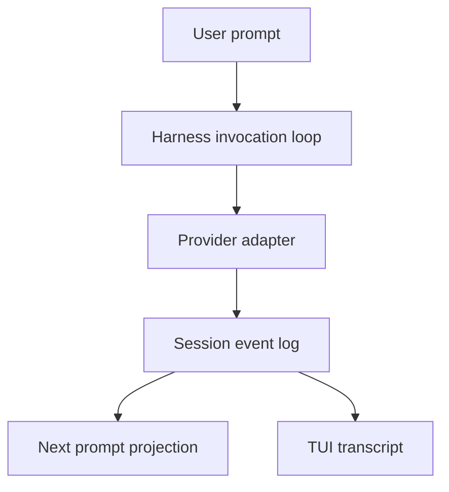
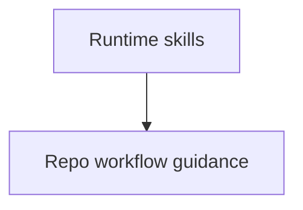
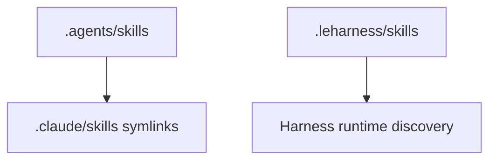

# PR Flow

Use this doc when committing, pushing, creating a PR, or writing/updating a PR description.

## Standard Flow

1. Confirm the worktree contains only intended changes:

   ```bash
   git status --short
   git branch --show-current
   ```

2. Run relevant checks from `.agents/skills/development-workflow/verification.md` unless they already ran after the latest relevant edit.
3. Stage and commit the intended changes. Use a concise title that names the system change.
4. Push the branch with upstream tracking when needed.
5. Create the PR against `main`.

For a fast PR request, commit and open the PR first, then run checks and push fixups.

## PR Description Standard

A PR description exists for the reviewer, not the author. The reviewer can read the diff; they need to know why the PR exists, what system idea changed, where the important ownership boundaries are, what to scrutinize, and what was verified.

Default to short paragraphs and bullets. Do not use Markdown tables in PR descriptions unless the user explicitly asks; GitHub's PR body width makes tables hard to read on real diffs.

Every PR description should start with a plain-language abstract. For non-trivial PRs, include context, concept-grouped changes, verification, and any risk or architecture notes that materially affect review.

## Abstract

Start every PR body with 1-4 sentences that explain why the PR exists and what it enables. No file paths, function names, or implementation inventory.

The abstract should answer:

- What changed in plain language?
- Why is this worth doing now?
- What future work, review quality, user behavior, or runtime capability does it unlock?

Good abstracts:

- "This makes agent skill guidance discoverable across Codex and Claude without duplicating source files."
- "This hardens dynamic event parsing so malformed session data fails at the boundary instead of leaking into the TUI."
- "This keeps MCP reconnect behavior consistent across config changes and transport failures."

Bad abstracts:

- "Updated `skills.ts` and `transcript.ts`."
- "Various cleanup and lint fixes."
- "See issue."

## Context

Include context when it changes how the reviewer should evaluate the PR. Do not pad tiny PRs with ceremonial context.

Useful context:

- Related issue, discussion, or previous PR.
- Why this work is happening now.
- Follow-up work the reviewer should expect.
- Whether this is repo developer guidance, runtime `.leharness` behavior, or package/CLI output.

If context matters and you do not have it, search the repo or ask the user before writing a context-free body.

## Changes

Group changes by concept or ownership boundary, not by file. Mention paths only to orient the reviewer to where the ownership lives.

Good boundary names for this repo:

- **Agent guidance:** `.agents/skills`, `.claude/skills`, `AGENTS.md`
- **Lint and type safety:** Oxlint, custom rules, typed readers
- **Harness core:** invocation, events, prompt building, providers, tools, tasks, subagents, artifacts, skills, compaction
- **MCP:** protocol, config, transport, auth, manager lifecycle
- **CLI:** app entrypoint, built-in tools, smoke scripts, package launcher
- **TUI:** transcript reducer, tool display, prompt input, slash commands, pickers
- **Packaging:** package exports, bundle, npm pack verification

Good:

```markdown
## Changes

**Agent guidance**
- Adds `.agents/skills` as the source of truth and mirrors it into `.claude/skills` with symlinks so future agents get the same repo workflow guidance.

**Lint and type safety**
- Adds type-aware Oxlint plus local rules that catch unsafe casts, double-bang coercion, enums, and noisy explicit `void` annotations.
- Replaces broad event and MCP casts with typed reader helpers at dynamic boundaries.
```

Bad:

```markdown
## Changes
- Updated `package.json`
- Updated `events.ts`
- Updated `transcript.ts`
- Added files under `.agents/skills`
```

## Design Decisions

Use this section when the chosen shape is not obvious from the diff. Name the alternative and why it was not chosen.

Examples:

- "We keep `.agents/skills` as the source of truth and make `.claude/skills` symlinks because duplicated skill bodies would drift."
- "We enforce `no-as-cast` through lint instead of relying only on guidance because agents tend to satisfy TypeScript with assertions under time pressure."
- "We isolate the OpenAI SDK casts at the adapter boundary because the overload types do not accept the shared provider-compatible request body."

Skip this section for tiny fixes or changes where the diff makes the tradeoff obvious.

## Architecture Diagrams

For larger PRs that change runtime boundaries, data flow, or ownership across packages, include a small Mermaid diagram. The diagram should make the system shape easier to review than prose alone. Keep it to one story and roughly 5-12 nodes.

Use Mermaid when a PR changes:

- Event flow across invocation, event log, prompt projection, and TUI/CLI rendering.
- Tool execution across local tools, MCP tools, shell tasks, subagents, and artifacts.
- Provider adapter behavior or streaming flow.
- MCP config/auth/transport/manager lifecycle.
- Skill discovery across `.agents/skills`, `.claude/skills`, and runtime `.leharness/skills`.
- Packaging or launcher flow that crosses workspace packages and packed npm output.

Skip Mermaid for:

- Narrow lint-only changes.
- Skill text changes with no runtime flow.
- Small import fixes, renames, formatting, or local helper cleanup.
- Diagrams that just restate one sentence.

Prefer top-to-bottom diagrams because GitHub PR bodies are narrow:



For before/after architecture, use paired diagrams with matching nouns:

**Previous flow**



**Target flow**



After the diagram, add 1-3 bullets explaining the important review point. Do not add a diagram just to decorate the PR.

## Pseudocode and Snippets

Use concise pseudocode or code snippets when the important review point is local logic, ordering, or core-loop behavior rather than package-to-package architecture.

Use diagrams for:

- Multi-component flow, ownership, or runtime boundaries.
- Before/after architecture across packages.
- Information flow between invocation, event log, prompt projection, tools, MCP, CLI, or TUI.

Use pseudocode or a short code snippet for:

- Core loop ordering, such as when events are recorded relative to tool execution.
- Branching logic that changed but stays inside one package.
- Parsing or normalization rules where the exact order matters.
- Retry, cancellation, drain, or stream handling that is clearer as ordered steps.
- A small before/after algorithm where a diagram would be too abstract.

Keep snippets tight: roughly 5-20 lines, omit incidental names, and show only the logic reviewers need to reason about. Label snippets as illustrative pseudocode when they are not exact code.

Good pseudocode:

```ts
// Illustrative ordering only.
record("tool.started")
const result = await runTool(call)
if (result.kind === "started") {
  record("task.started", result.task)
  return
}
record(result.kind === "ok" ? "tool.completed" : "tool.failed")
```

Good explanation after the snippet:

- The important change is that task-starting tools now record the foreground tool call before handing ownership to the background task.
- Existing transcript and prompt projections still read from the same event log.

Do not paste large production functions into the PR body. Link to the owning file if reviewers need the exact implementation.

## Behavior Changes

Use this section when runtime behavior changes in a way reviewers should reason about.

For leharness, call out:

- Event compatibility: new or changed event fields, replay behavior, old-session tolerance.
- Async lifecycle: cancellation, background drain, stream close/error behavior.
- Prompt projection: how events become model input.
- UI projection: how events become CLI/TUI output.
- External boundaries: provider SDKs, MCP servers, file configs, JSON parsing.

Do not add this section for docs-only, type-only, or test-only changes unless the behavior change is the point of the PR.

## Risk and Rollback

Use this for PRs that touch durable session state, package output, provider behavior, MCP auth/transport, or compaction.

Answer only what matters:

- What could break?
- How would the failure show up?
- Can this be rolled back by reverting the PR, or does it affect persisted session data or published packages?

Skip this section for small local refactors or documentation-only changes.

## Testing Done

Use the exact heading `## ***Testing Done***`.

List commands that actually ran and what they cover. Mention manual checks only when they add information beyond the command.

Examples:

```markdown
## ***Testing Done***
- `pnpm lint`
- `pnpm -r build`
- `pnpm smoke`
- `pnpm knip`
- `pnpm package:verify`
```

If a relevant check did not run, say why and name the remaining risk.

## Calibrate Depth

Match the PR body to the PR's size and risk.

- **Tiny fix:** one-sentence abstract plus `## ***Testing Done***`.
- **Small bug fix:** abstract, concise context if needed, changes, testing.
- **Medium behavior change:** abstract, context, concept-grouped changes, testing, and any design decision reviewers would ask about. Add concise pseudocode when ordering or local logic is the review risk.
- **Large or cross-boundary change:** abstract, context, changes by ownership boundary, design decisions, Mermaid diagram, behavior changes, risk/rollback, testing.
- **Agent guidance or lint PR:** explain what future agents or lint rules will now enforce, why automation vs. guidance was chosen, and how skill layout is validated.

Before publishing, prune the body:

- Delete sections that would say "N/A", "no change", or "nothing to report".
- Merge sections that repeat the same idea.
- Move regression-test details to `## ***Testing Done***`, not `Changes`.
- Remove file-by-file narration.

## Common Mistakes

- No abstract; the reviewer has to infer intent from the diff.
- Listing files instead of concepts.
- Using wide Markdown tables in the PR body.
- Adding Mermaid for decoration instead of clarity.
- Missing Mermaid when a large PR changes package or runtime boundaries.
- Missing concise pseudocode when the PR changes core-loop ordering or local information flow that a diagram would hide.
- Putting tests under `Changes`.
- Publishing empty or N/A sections.
- Writing "various improvements" instead of the specific system improvement.
- Forgetting to update the PR body after fixup commits change the final shape.
